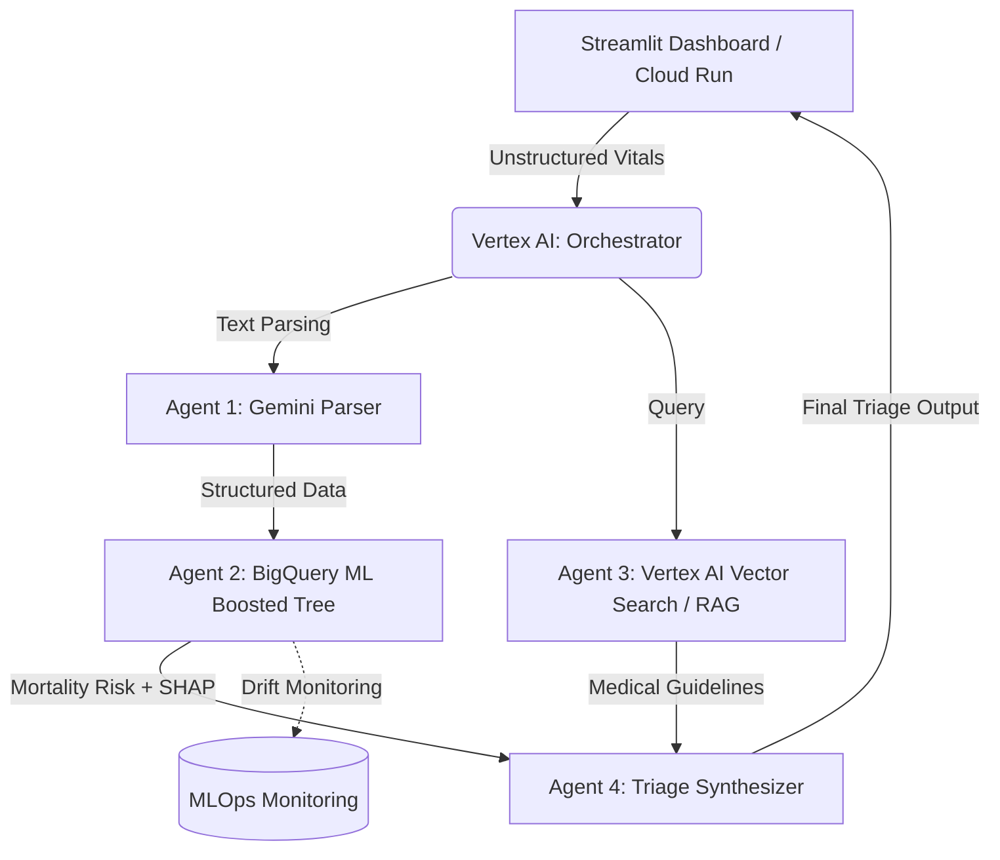
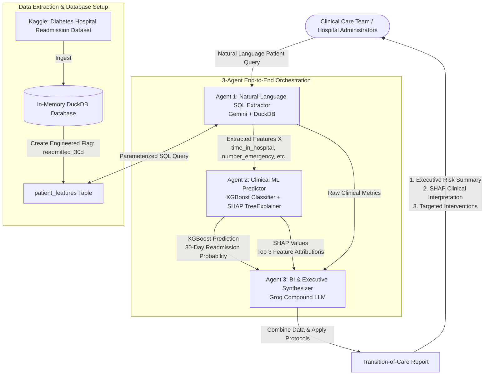

# System Architecture Portfolio: Multi-Agent AI Applications
### N M Emran Hussain | AI & Machine Learning Engineer

## 1. Cardiovascular Risk Assessment & Triage Assistant

**Architecture Overview:** A serverless, 4-agent clinical pipeline deployed on Google Cloud Platform, designed to parse unstructured vitals, predict mortality risk, and retrieve relevant medical guidelines using advanced RAG capabilities.

**Core Stack:** Vertex AI Gemini, BigQuery ML, Vertex AI Vector Search, Cloud Run, Docker, Streamlit.

**System Data Flow:**

**User Interface:** Serverless Streamlit dashboard hosted on Cloud Run receives unstructured patient vitals.

**Agent 1 (Parser):** Vertex AI Gemini processes and structures the raw text inputs.

**Agent 2 (Predictor):** BigQuery ML Boosted Tree ingests structured data to predict heart failure mortality, utilizing SHAP for feature explainability.

**Agent 3 (Retriever):** Vertex AI Vector Search executes a RAG workflow to retrieve contextually relevant medical guidelines.

**Agent 4 (Synthesizer):** Combines the SHAP explainability and retrieved guidelines into a final triage recommendation.

**Monitoring:** Active MLOps drift monitoring tracks model performance continuously.

## 2. DiaVigil: Diabetic Readmission Risk & Clinical BI Copilot
**Architecture Overview:** A 3-agent application architected to orchestrate rapid LLM evaluations of 30-day readmission risks across 101,700+ patient records, pipelining automated risk drivers into executive cohort visualizations.

**Core Stack:** Groq API, DuckDB, XGBoost, SHAP, Plotly, Google Colab.

**System Data Flow:**

**Data Ingestion:** DuckDB executes high-speed SQL extraction from the raw clinical dataset (101,700+ records).

**Agent 1 (Data Processor):** Routes the extracted SQL data into feature sets for modeling.

**Agent 2 (Predictive Engine):** XGBoost evaluates the features to predict 30-day readmission risk, generating SHAP risk drivers.

**Agent 3 (BI Copilot):** Groq API rapidly orchestrates the LLM to synthesize the SHAP outputs and model predictions.

**Output Presentation:** Interactive Plotly cohort visualizations are rendered directly within Google Colab for executive review.

